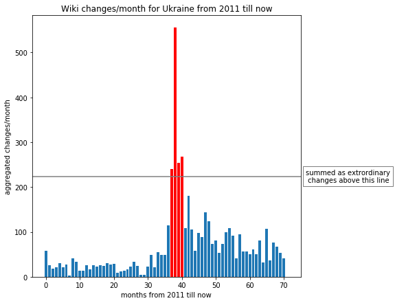
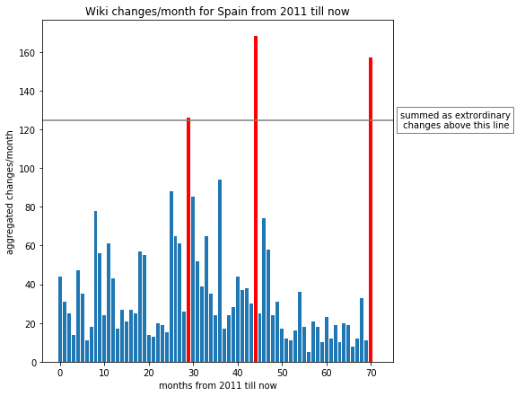
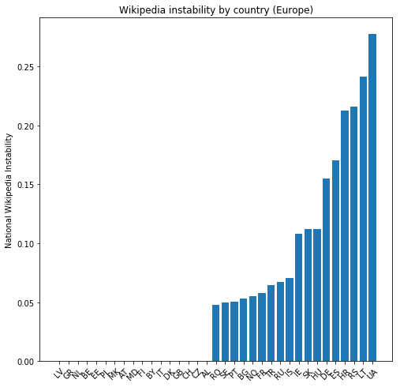

# Wikipedia Changes and World Events
-----------------------------------

# Abstract

In the light of recent events, we noticed that after a substantial event, be it international, local, or even specifically related to a famous person, the wikipedia page of that entity gets updated quite fast and abundantly in a relatively short period of time. Following that, we decided to attempt to combine Wikipedia datasets with an events dataset comprising of anything substantial happening in the world (political conflict, natural disaster or important news). Ultimately, our goal is to obtain a good indicator of correlation between Wikipedia traffic and number of changes for the pages related to the event with the event time of occurence. 

---------

# Research questions

Below are the initial research questions we planned to achieve at the beginning of our project. Throughout this **datastory**, we will show which question we managed to answer, and which weren't feasible in the first place.

1. Is the number of changes in country-clustered Wikipedia information (number of pages, major edits to existing pages) a good indicator of stability of the country? 

2. How fast, how far, and for how long are the news about events (.e.g. Conflict between countries) spread in Wikipedia (for the country page and related pages)?
(this is to be analysed if we have time, its more complicate)

3. Maybe, for some events, we could observe a lot of changes in wikipedia directly before the occurrence of the event ?

4. Is it possible to predict / detect an event and its location from Wikipedia statistics?

5. Compare how deep the effect a certain event has on the Wikipedia pages network between different time eras.
 -------------

# Datasets Used

### Wikipedia:
1. <a href="https://www.gdeltproject.org/data.html">Wikipedia</a>: in order to grab the edits history for any wikipedia page, we used wikipedia's API and proxied it through our HistoryFetcher class.  

### Event data:
1. <a href="http://ucdp.uu.se/downloads/ged/ged171.pdf">UCDP GED</a>: Initially we selected the UCDP GED dataset in order to get the "main events". Unfortunately, as this dataset contains only armed events, we were not able able to find a good visual argument for our intuition and thus sought an alternative.
2. This is why we decided to switch to a richer dataset: <a href="https://www.gdeltproject.org/data.html">GDELT Events</a>, which is a free cloud-based service that offers a variety of tools and services to allow you to visualize, explore, and export both the GDELT Event Database and the GDELT Global Knowledge Graph. In order to handle the data, we used a library called gdeltPyR.
3. Our own knowledge (Barcelona leaving Spain, UK leaving EU)

---------------- 

# A list of internal milestones :

Below are the initial internal milestones we planned to achieve at the beginning of our project. Throughout this datastory, we will show which question we managed to answer, and which weren't feasible in the first place.

1. Get cluster of wikipedia pages for a few countries.[Rescheduled]
2. Find a way to link events to some wikipedia pages.  [Done]
3. Study the impact of main events on the country-clustered wikipedia pages [ work in progress, analyse more events ]
4. Study Changes of wikipedia as an impact on stability of the country [ work in progress, analyse more countries, make a world map not only Europe]
4. Improve event detector for wikipedia changes
5. Add multiple wikipedia pages (tree) to single events

-------------------

# A Prototype for our Country's Stability Index 

This first index is more of intuition-based and is rather simple but still very reflective. In fact, we have found that it does lead to interesting and righteous results. Nevertheless, the index still suffered from certain flaws. 

## How it works  

Firstly, we designed a classifier function called <a href="https://github.com/Amaumaury/ada-2017/blob/project-model-2/project/helpers/wiki_helpers.py">*wiki\_change\_factor*</a>. What this function does boils down to the following:

1. With the help of the <a href="https://github.com/Amaumaury/ada-2017/blob/project-model-2/project/helpers/history_fetcher.py">*history_fetcher*</a>  sub-function, the function fetches the edits of a certain country's Wikipedia page and sub-pages. 
2. Afterwards, we use our own tuneable outlier detector to detect the time periods with extraordinary edit rates and label those as outliers. 
3. Finally, we sum all the *extraordinary* edits and divide them by the sum of all edits. This ratio is then the stability index. 

## Results
For a more visual explanation of how the stability index works, the following plots have also been generated by <a href="https://github.com/Amaumaury/ada-2017/blob/project-model-2/project/helpers/wiki_helpers.py">*wiki\_change\_factor*</a>. The *extraordinary* changes are highlighted in red.

#### Ukraine

Wikipedia Instability for Ukraine : 0.277695716396

*Add comments about above graph*

#### Spain

Wikipedia Instability for Spain : 0.170639424896
*Add comments about above graph*

#### Europe

We then globalized the instability index for all of Europe: 

We could observe, that as expected some very developed and stable countries have very stable wikipedia, and the less stable also less stable wikipedia. However we could observe some interesting facts for some nations:

1. Ukraine has lots of instability due to war which is shown well in our results.
2. Germany or Croatia has a lot of instability in its Wikipedia. This can be traced back to some major events to be correlated.
3. The computed instability factor highly depends on computation method, another strong reason to optimize the stability index in order to improve its accuracy and robustness.
4. 
<iframe 
src = "Instability-Map-Europe.html" width = "500" height = "500"> </iframe>